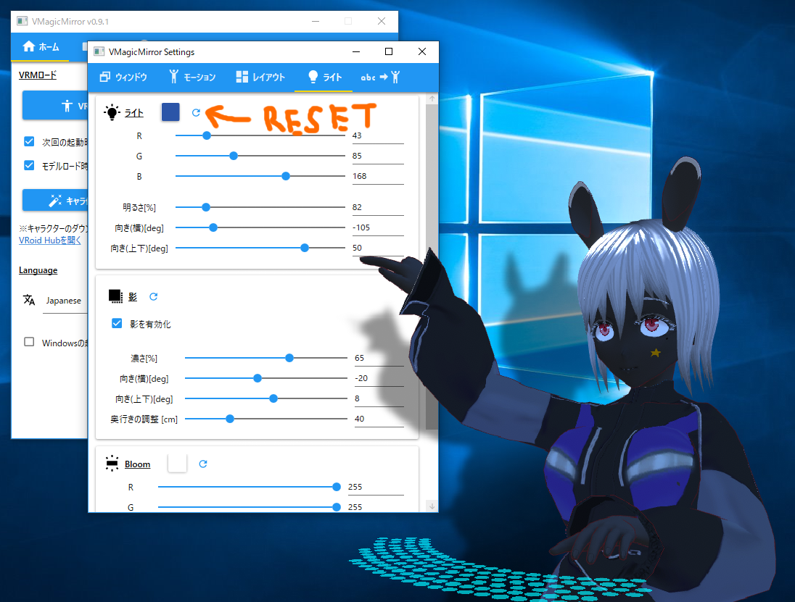

# 3. 詳細設定

[English](./en_about_settings.html)

## 設定ウィンドウ

コントロールパネルの`ホーム`タブで`設定ウィンドウを開く`ボタンを押すと設定ウィンドウが開きます。

{: data-lightbox="img01_010"}

設定ウィンドウはコントロールパネルで表示していない、細かな機能をサポートしています。

* [3.1. ウィンドウ](./settings_window.html)
    - キャラクター表示ウィンドウの制御
* [3.2. モーション](./settings_motion.html)
    - キャラクターの体型や動き方にあわせた調整
* [3.3. レイアウト](./settings_layout.html)
    - カメラ、キーボード、タッチパッド、ゲームパッドの配置
* [3.4. エフェクト](./settings_effects.html) (※v0.9.2以前では`ライト`タブという名称です)
    - ライト、影、Bloom、風の調整
* [3.5. 表情の制御](./settings_expressions.html)
    - 表情やモーションを切り替える機能の設定

詳細については各ページを参照下さい。

## 設定をリセットするには

v0.9.2以降では、大部分の設定をカテゴリ別にリセットできます。

詳細設定ウィンドウで、各項目の上部にあるリセットボタンをクリックします。

以下の例では、ライトの設定を初期状態にリセットしています。

{: data-lightbox="img01_140"}

{: data-lightbox="img01_150"}



