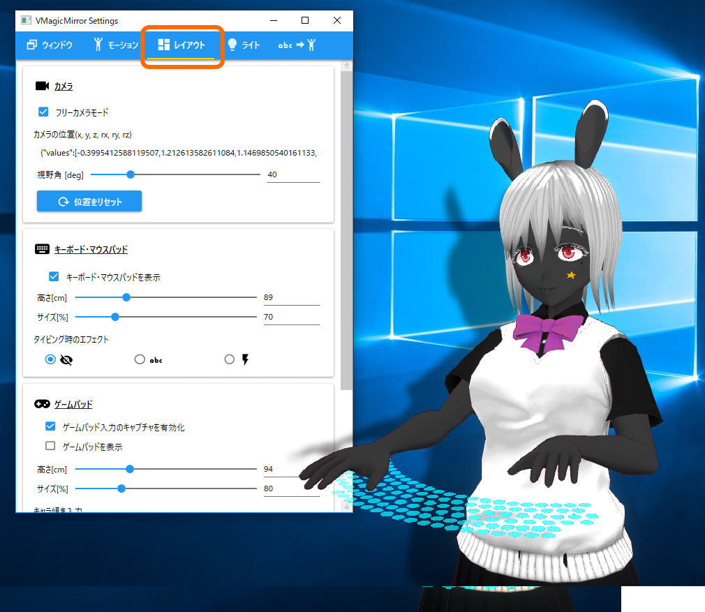

# 3.3. レイアウト

`レイアウト`タブではカメラ、キーボード、ゲームパッドなどの配置を調整できます。

{: data-lightbox="img01_050"}

## 3.3.1. カメラ

コントロールパネルの`配信`タブにある`カメラ`とほぼ同じ機能ですが、ここで視野角を設定することもできます。

## 3.3.2. デバイスのレイアウト

v0.9.5以降で追加されています。

コントロールパネルの「配信」にある「デバイスのレイアウト」と同じ機能です。

## 3.3.3. キーボード / MIDI

キーボードの表示、およびタイピング時のエフェクトを調整できます。

また、v0.9.4以前のバージョンをお使いの場合、ここでキャラクターの体格に応じてサイズを調整できます。

v0.9.6以降ではMIDIコントローラの設定が追加されています。VMagicMirrorのMIDI入力は表情の切り替え機能のために使用されます。

DAWソフトなどでMIDI入力を用いる場合や、手元にMIDIコントローラが無い場合は、`MIDIコントローラをVMagicMirrorで使用`のチェックをオフにします。

## 3.3.4. ゲームパッド

v0.9.4またはそれ以前のバージョンの場合は、ゲームパッドの高さや大きさをここで調整します。

また、ゲームパッドのスティックを傾けるとキャラクターも傾きます。動作を確認する場合、デフォルト設定のまま左スティックを動かしてみて下さい。

* `キャラ傾き入力`でキャラクターが傾くスティックの種類を変更できます。
* `傾く方向を反転`のチェックをオンにすると、スティック入力と逆方向にキャラクターが傾きます。

なお、デフォルトではゲームパッドのキャプチャが有効ですが、ゲームパッドを使わない場合で、かつVMagicMirrorのCPU消費を少しでも抑えたい場合は`ゲームパッド入力のキャプチャを有効化`をオフにします。


