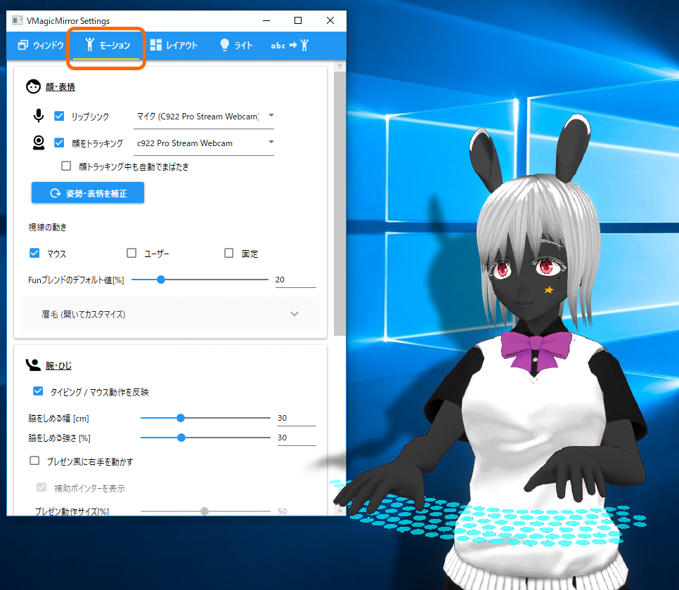
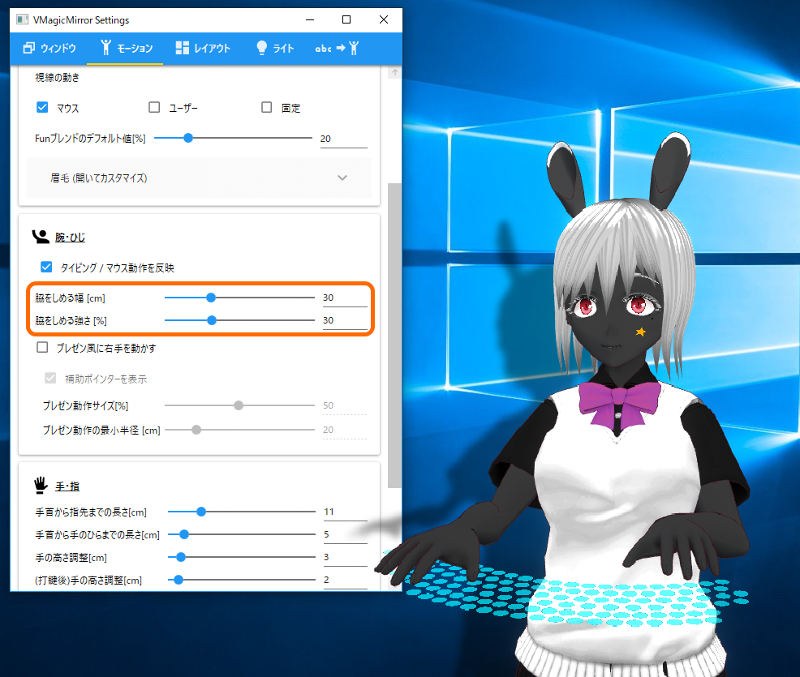
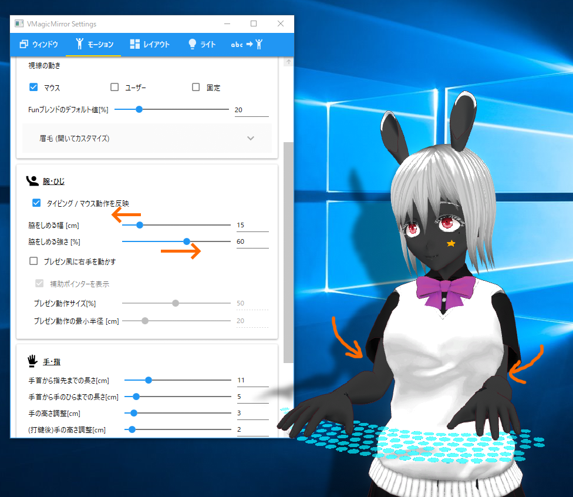
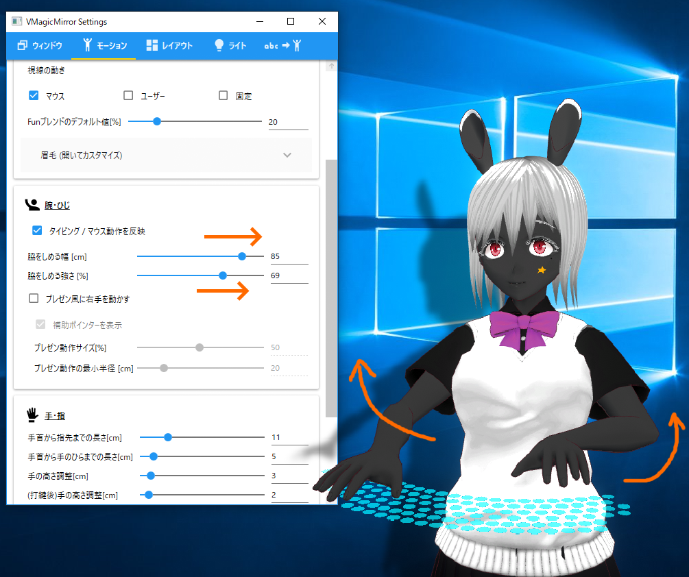
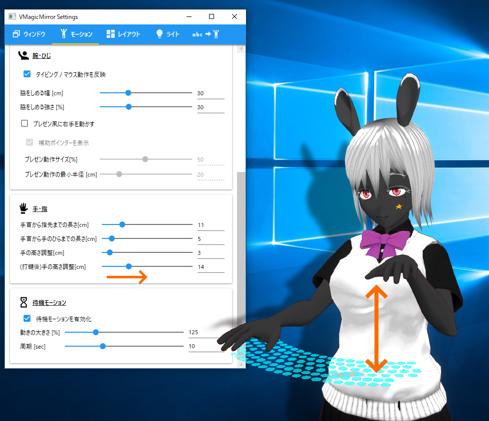

# 3.2. モーション

`モーション`タブではキャラクターの動き方や体型にかんする調整ができます。

{: data-lightbox="img01_018"}

## 3.2.1. 顔・表情

上部の項目はコントロールパネルの`配信`タブで`顔・表情`に表示されているのとほぼ同じですが、詳細な設定が可能です。

`顔トラッキング中も自動でまばたき`チェックをオフにすると、画像処理ベースで目の開閉を制御するようになります。

またv0.9.6以降では`顔トラッキング中の前後移動を有効化`チェックをオンにすることで、キャラクターが前後に動くようになります。手元のPC環境で顔トラッキングが安定している場合はこのチェックをオンにしますが、キャラクターがガクガクしてしまう場合はオフに戻します。

下部の`Funブレンドのデフォルト値[%]`は、キャラクターの表情をつねにやや笑顔に保つための設定値です。

大きくするほど基本の表情が笑顔になりますが、キャラクターによってはまばたきやリップシンクの動作と組み合わせたとき不自然になるため、その場合は小さな値にします。

その下の`眉毛(開いてカスタマイズ)`は、通常開く必要のない高度な機能です。独自に作成したVRMで眉毛をうまく動かしたい場合や、眉毛の動きが大きすぎたり、小さすぎたりする場合にカスタマイズします。

※ここをカスタマイズするにはVRMの表情を操作する「ブレンドシェイプ」の知識が必要です。もし詳しくない場合、[バーチャルキャストWikiの説明](https://virtualcast.jp/wiki/doku.php?id=%E3%83%A2%E3%83%87%E3%83%AB%E4%BD%9C%E6%88%90:%E3%83%96%E3%83%AC%E3%83%B3%E3%83%89%E3%82%B7%E3%82%A7%E3%82%A4%E3%83%97%E8%A8%AD%E5%AE%9A)に記載の`ブレンドシェイプの値設定`などをご覧下さい。

* `左眉上げ`: 左眉、あるいは両方の眉を上げるブレンドシェイプを指定します。
* `左眉下げ`: 左眉、あるいは両方の眉を下げるブレンドシェイプを指定します。
* 左右で別々のキーを使う: 右と左の眉が別々に動かせるモデルの場合、チェックをオンにします。
* `右眉上げ`: 右眉を上げるブレンドシェイプを指定します。
* `右眉下げ`: 右眉を下げるブレンドシェイプを指定します。
* `眉上げスケール [%]`と`眉下げスケール [%]`: 眉の上下の動きの大きさです。誇張したい場合は大きめの値を、大きくしすぎると不自然になる場合は小さめの値を指定します。

## 3.2.2. 腕・ひじ

腕やひじの動かし方を設定します。

`タイピング/マウス動作を反映`チェックをオフにすると、タイピングやマウス、ゲームパッドの動作を行わなくなります。キャラクターを完全に棒立ちさせたい場合、このチェックをオフにします。

`脇をしめる幅 [cm]`と`脇をしめる強さ [%]`は、キャラクターが脇をしめたまま動くためのパラメータです。

`脇をしめる幅 [cm]`は、キャラクターの腰が太い場合は大きくし、細い場合は小さくします。

`脇をしめる強さ [%]`は、脇をしっかりしめてほしい場合、大きくします。大きすぎる値を指定すると、腕が体にめり込みやすくなることに注意してください。

以下は、デフォルトの設定、脇をきつくしめる設定、脇を開いた設定の例です。

{: data-lightbox="img01_020"}

{: data-lightbox="img01_030"}

{: data-lightbox="img01_040"}

`補助ポインターを表示`では、`プレゼン風に右手を動かす`のチェックがオンのときにマウスポインターを強調するかどうかを設定します。

`プレゼン動作サイズ[%]`は、`プレゼン風に右手を動かす`のチェックがオンのときの指さし動作の大きさを指定します。

モニターサイズに比べてキャラクターが小さい場合、この値を小さくすることで、腕が伸びっぱなしになるのを防ぎます。

逆に、モニターに対してキャラクターが大きかったり、キャラの手元を指し示したいときは、この値を大きくします。

`プレゼン動作の最小半径[cm]`は、指さし動作中に右手が胴体にめり込まないためのパラメータです。

大きな値にすると手が体にめり込みにくくなりますが、手元を指しにくくなり、腕が伸びがちになります。

## 3.2.3. 手・指

手や指の長さと、打鍵動作の大きさを調整します。

タイピング中の手の位置が大きくずれてしまう場合や、手がキーボードから浮きすぎる場合、調整してみてください。

**Hint:** 自然な動きに調整したのち、わざと`(打鍵後)手の高さ調整[cm]`の値だけを大きくすることで、大げさにタイピング動作するようにできます。

{: data-lightbox="img01_045"}

## 3.2.4. 待機モーション

待機モーションは呼吸動作に相当する動きです。

キャラクターによっては、動きを極端に大きくすると浮いて見えるかもしれません。



